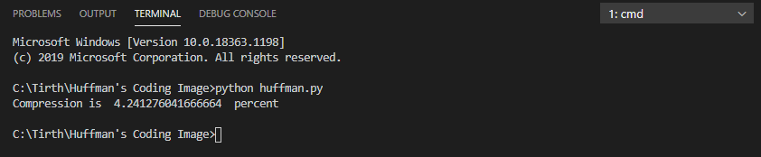

### Title
Huffman encoding for Image
### Description
Huffman coding is used for compress of files(Image, Text, Audio).
Performs Huffman encoding for a 2D image 
Writes the codes (for each pixel value) in a text file and prints the efficiency of the compression scheme
#### Testing / Running the program
1. Save / Clone the above repository
2. The repository consists of a sample Image file.
3. Run the python code `huffman.py` to compress the given sample file. For eg. open terminal and run `python huffman.py`

4. The above command will perform compression on the sample Image file present here. The compressed file will be present at the same location.
Change the image name inside the function (replace it with the image location in your system) and run it using python

Type 'python huffman.py' in the command line to run the program
